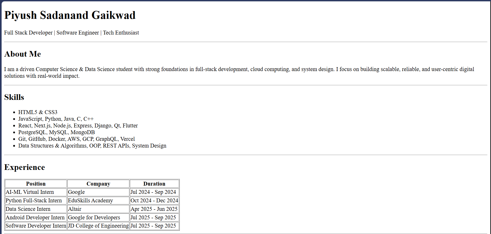
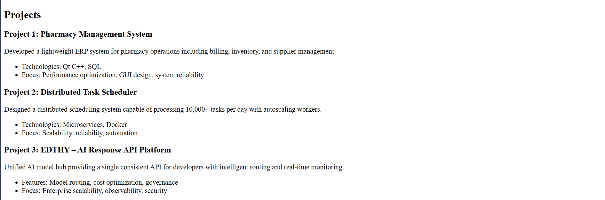
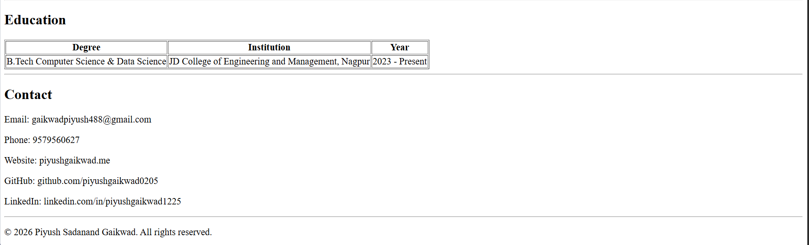

# Resume Project

This project is a simple HTML-based resume. It includes a preview and setup instructions.

## Project Structure

- `resume.html` — Main HTML file for the resume
- `images/` — Contains images used in the resume and preview screenshots
- `Readme.md` — Project documentation (this file)

## Setup Instructions

1. **Clone or Download the Repository**
	- Clone the repository using Git:
	  ```sh
	  git clone <repository-url>
	  ```
	- Or download the ZIP and extract it.

2. **Open the Project**
	- Open the project folder in your preferred code editor (e.g., VS Code).

3. **View the Resume**
	- Open `resume.html` in your web browser to view the resume.

## Project Preview

Below are preview images of the resume:





## Customization

- Edit `resume.html` to update your personal information, skills, and experience.
- Add or replace images in the `images/` folder as needed.

## License

This project is for personal use. Feel free to modify and use it as needed.